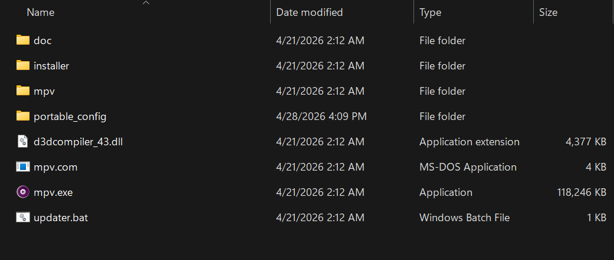

# mpv-config

A personal mpv configuration focused on high-quality playback, streaming support, and a clean customizable interface — suitable for both local files and YouTube/web video.


---

## Highlights

- **Automatic shader profiles** — shaders are applied based on source resolution without any manual switching. HD content, SD content, and 4K downscaling each get their own optimal pipeline.
- **Vulkan renderer** — uses `gpu-next` with Vulkan for the best performance and quality on modern hardware.
- **Streaming ready** — quality-menu for on-the-fly stream selection, SponsorBlock integration, YouTube subtitle support, and stream reload for stuck playback.
- **Extensive shader library** — includes CuNNy, ArtCNN, FSRCNNX, NNEDI3, RAVU, Anime4K, ACNet/ARNet, and more, all accessible from the uosc menu. Every shader is documented inline in `input.conf`.
- **Surround downmix** — 5.1 and 7.1 audio is automatically downmixed to stereo. Disable if you have a surround system.
- **Cross-platform** — works on Windows, Linux, and macOS.

---

## Table of Contents

- [Installation](#installation)
  - [Windows](#windows)
  - [Linux / macOS](#linux--macos)
- [Settings You May Want to Change](#settings-you-may-want-to-change)
- [Important Notes](#important-notes)
- [Included Scripts](#included-scripts)
- [Included Shaders](#included-shaders)
- [References](#references)

---

## Installation

### Windows

#### 1. Download mpv

Download the latest 64-bit Windows build from the Shinchiro builds page:

[Download mpv for Windows](https://github.com/shinchiro/mpv-winbuild-cmake/releases)

- `mpv-x86_64-*.7z` — for old hardware only (pre-2013 CPUs)
- `mpv-x86_64-v3-*.7z` — recommended for most systems (Intel Haswell 2013+, AMD Zen 2015+)

Extract the archive somewhere permanent. This folder will be your main mpv folder — do not move it after installation.

#### 2. Install File Associations

Inside the mpv folder, open the `installer` folder, right-click `mpv-install.bat`, and select **Run as administrator**.

After it finishes, Windows may prompt you to set mpv as the default media player in Control Panel.

#### 3. Install This Configuration

[Download this repository as a ZIP](https://github.com/HongYue1/mpv-config/archive/refs/heads/main.zip), extract it, and copy the `portable_config` folder into your mpv folder — next to `mpv.exe`.

Your mpv folder should look like this:



#### 4. Update mpv / Install yt-dlp + ffmpeg

Right-click `updater.bat` and select **Run as administrator**. The updater lets you update mpv and optionally install `yt-dlp` and `ffmpeg`, which enables streaming from YouTube and hundreds of other sites.

[Supported sites](https://github.com/yt-dlp/yt-dlp/blob/master/supportedsites.md)

#### 5. Updating the config

To update the configuration, delete the old portable_config then redo step 3 of the installtion to download the latest version.

---

### Linux / macOS

#### 1. Install mpv

**Ubuntu / Debian**

```sh
sudo apt install mpv
```

**Arch Linux**

```sh
sudo pacman -S mpv
# or for the git version:
yay -S mpv-git
```

**macOS**

```sh
brew install mpv
```

#### 2. Option 1: Install the Configuration manually

[Download this repository as a ZIP](https://github.com/HongYue1/mpv-config/archive/refs/heads/main.zip), extract it, and copy the contents of `portable_config` into `~/.config/mpv/` (create the folder if it doesn't exist).

#### 3. Option 2: Install with Git instead

```sh
git clone https://github.com/HongYue1/mpv-config.git && mkdir -p ~/.config/mpv && cp -r ./mpv-config/portable_config/. ~/.config/mpv/ && rm -rf mpv-config
```

---

## Settings You May Want to Change

For full option documentation, see the [mpv manual](https://mpv.io/manual/master/) (use `Ctrl+F` to search).

### GPU API and Hardware Decoding

This config defaults to Vulkan. If your GPU doesn't support Vulkan or you have playback issues:

**`mpv.conf`**

```conf
gpu-api=vulkan      # change to: auto, d3d11, or opengl
hwdec=vulkan        # change to: auto, auto-copy, or auto-safe
```

> [!Note]
> On Linux Set hwdec to auto or auto-copy (try both) if you face any playback issues especially with youtube videos.

> [!Note]
> nvdec and nvdec-copy are the newest, and recommended method to do hardware decoding on Nvidia GPUs. [Docs](https://mpv.io/manual/stable/#options-hwdec:~:text=nvdec%20and%20nvdec%2Dcopy%20are%20the%20newest%2C%20and%20recommended%20method%20to%20do%20hardware%20decoding%20on%20Nvidia%20GPUs.)

### Default Shader for HD Content

The default shader for 720p–1080p content is modified shader combining SSimSuperRes and adaptive-sharpen with some modifications which is great for live action and good should be relativly good for Anime too. Also compared to CuNNY as a default, it's more general and doesn't requrie vulkan.

**`profiles.conf`**

```conf
glsl-shader="~~/shaders/SSim/SSSR+AdaptiveSharpening_Medium_Sharpening.glsl"
```

> [!Note]
> If you primarily watch live-action content or aren't using Vulkan, delete or replace this line with a shader that suits your content.

### Dither Depth

Set this to match your display's bit depth:

**`mpv.conf`**

```conf
dither-depth=10   # change to 8 for 8-bit displays, or auto if using d3d11
```

On Windows, check your display bit depth under **Settings → System → Display → Advanced display**.

### YouTube Playback Quality

Default is 1080p. Change the number to set a different cap:

**`mpv.conf`**

```conf
ytdl-format=bestvideo[height<=?1080]+bestaudio/best[height<=?1080]
```

### Audio Downmixing

By default, 5.1 and 7.1 audio is downmixed to stereo. If you have a surround system, remove or comment out the `Downmix_Audio_5_1` and `Downmix_Audio_7_1` profiles in `profiles.conf`.

### ICC Color Profile

`icc-profile-auto` is disabled by default because it can cause gamma issues on some systems. Enable it in `mpv.conf` if you have a calibrated ICC profile and want mpv to use it.

### Video Output Range

**`mpv.conf`**

```conf
video-output-levels=full   # change to limited for TVs, or auto
```

### Windows-Only Options

Only enable these if you are on Windows with `gpu-api=d3d11`:

```conf
d3d11-exclusive-fs=yes
dither-depth=auto
```

### UI font scale

If the UI font looks too small, especially on Linux, you can edit the following line in `portabe_config/script-opts/uosc.conf`

```
# Adjust the text scaling to fit your font
# Try something like 1.25 for 125% scaling
font_scale=1
```

### Getting keyboard Multimedia key support on linux (MPRIS)

- Download the latest `mpris-x86_64-unknown-linux-gnu.so` file from here: https://github.com/eNV25/mpv-mpris2/releases
- Rename it to `mpris.so` and move it to the `~/.config/mpv/scripts/` folder.
- Multimedia keys and desktop integrations should work now.

### Youtube playback on Linux

Make sure to the latest yt-dlp version, preferably the latest standalone binary.

```bash
sudo curl -L https://github.com/yt-dlp/yt-dlp/releases/latest/download/yt-dlp -o /usr/local/bin/yt-dlp
sudo chmod +x /usr/local/bin/yt-dlp
```

---

## Important Notes

### First Launch May Be Slow

When launching mpv for the first time with this configuration, or when a shader is used for the first time, mpv may freeze for a few seconds while it compiles and caches the shader. This only happens once per shader — subsequent launches are fast.

### Sluggish UI During Playback

If the uosc interface feels slow during playback, add this to `mpv.conf`:

```conf
video-sync=display-resample
```

This slightly increases CPU/GPU usage but makes the UI feel more responsive. The root cause is that mpv ties UI rendering frequency to the video frame rate during playback — pausing the video will reveal the difference.

### Ghosting or Scene Retention with VRR (G-Sync / FreeSync)

If you notice ghosting, smearing, a faint "hold" of the previous scene on hard cuts, or a **dark trail behind moving objects (often worst in fullscreen)** — especially with low-framerate content (24/25 fps film) — the cause is almost always **Variable Refresh Rate (G-Sync / FreeSync)**, not mpv or the shaders. (It happens with all shaders disabled too.)

Your panel's pixel overdrive is calibrated for its maximum refresh rate. When VRR lowers the panel to a low/variable refresh to match 24/25 fps video, the overdrive is mistuned and pixels smear or trail. Below the VRR floor (~48 Hz), Low Framerate Compensation duplicates frames, which reads as scene retention on cuts.

**Fix:** force mpv to a **fixed refresh rate** instead of VRR. Note that the per-app **Monitor Technology = Fixed Refresh** option in NVIDIA Control Panel is often *not* enforced in exclusive fullscreen — G-Sync quietly re-engages there. The reliable fix is [NVIDIA Profile Inspector](https://github.com/Orbmu2k/nvidiaProfileInspector):

1. Open NVIDIA Profile Inspector and create/select a profile that applies to `mpv.exe`.
2. Under **2 - Sync and Refresh**, set **GSYNC - Application State** to **Fixed Refresh Rate** (`Force Off` also works).
3. Apply. You can leave G-Sync enabled globally for games — only mpv is forced to fixed refresh.

This keeps the panel at its native max refresh during playback (e.g. 165 Hz), where the pixel overdrive is correctly tuned, which eliminates the trailing/ghosting in both windowed and fullscreen — at no extra GPU/power cost and with no frame interpolation.

> [!Note]
> Optional: choosing a fixed refresh that is an integer multiple of the frame rate (25 fps → 150 Hz, 24 fps → 144 Hz) also removes the mild motion judder from non-integer ratios (e.g. 165 ÷ 25 = 6.6). That is about smoothness, and is separate from the ghosting fix above.

### Toggle the UI

Press `Tab` to toggle uosc between always-visible and auto-hide mode.

### Shaders

The uosc right-click menu exposes the full shader library, grouped by type. All shader variants are documented inline in `input.conf`. To clear all active shaders: `Ctrl+Alt+C`. To show all active shaders: `Ctrl+Alt+S`.

---

## Included Scripts

| Script                                                                          | Description                                           |
| ------------------------------------------------------------------------------- | ----------------------------------------------------- |
| [uosc](https://github.com/darsain/uosc)                                         | Minimalist, highly customizable GUI                   |
| [evafast](https://github.com/po5/evafast)                                       | Hold-to-fast-forward with adaptive speed ramp         |
| [thumbfast](https://github.com/po5/thumbfast)                                   | High-performance on-the-fly thumbnail generation      |
| [memo](https://github.com/po5/memo)                                             | Recent files/history menu with uosc integration       |
| [quality-menu](https://github.com/natural-harmonia-gropius/mpv-quality-menu)    | Change stream quality (video/audio format) on the fly |
| [mpv-reload](https://github.com/4e6/mpv-reload)                                 | Reload stuck or slow streams automatically            |
| [mpv-ytsub](https://github.com/Idlusen/mpv-ytsub)                               | Load YouTube auto-generated captions                  |
| [mpv_sponsorblock_minimal](https://codeberg.org/jouni/mpv_sponsorblock_minimal) | Skip SponsorBlock-tagged segments                     |

---

## Included Shaders

Shaders are organized by category in `portable_config/shaders/`. All are accessible and documented in `input.conf`.

**Luma Upscalers**

| Shader                                                              | Best for                                                                      |
| ------------------------------------------------------------------- | ----------------------------------------------------------------------------- |
| [CuNNy](https://github.com/funnyplanter/CuNNy)                      | Anime — fast CNN upscaler with multiple quality tiers and dp4a acceleration   |
| [ArtCNN](https://github.com/Artoriuz/ArtCNN)                        | General content — modern CNN upscaler with denoising and downscaling variants |
| [Ani4Kv2 / AniSD](https://github.com/Sirosky/Upscale-Hub)           | Anime — Ani4Kv2 for HD/BD, AniSD for sub-720p sources                         |
| [FSRCNNX](https://github.com/igv/FSRCNN-TensorFlow/releases)        | Live-action — high quality prescaler, x2 8-0-4-1 and 16-0-4-1 variants        |
| [NNEDI3](https://github.com/bjin/mpv-prescalers)                    | High-quality prescaling, slower than FSRCNNX                                  |
| [RAVU](https://github.com/bjin/mpv-prescalers)                      | Fast prescaling — Lite, Zoom, and Antiringing variants                        |
| [Anime4K](https://github.com/bloc97/Anime4K/tree/master/glsl)       | Anime upscaling and restoration — full shader set included                    |
| [ACNet / ARNet](https://github.com/TianZerL/ACNetGLSL)              | Lightweight anime upscalers from Anime4KCPP with denoising variants           |
| [AMD CAS, FSR, NVScaler, NVSharpen](https://gist.github.com/agyild) | GPU vendor upscalers and sharpeners                                           |

**Chroma Upscalers**

| Shader                                                                             | Notes                                                        |
| ---------------------------------------------------------------------------------- | ------------------------------------------------------------ |
| [CfL Prediction](https://github.com/Artoriuz/glsl-chroma-from-luma-prediction)     | Default — uses luma information to reconstruct chroma detail |
| [KrigBilateral](https://gist.github.com/igv)                                       | Alternative chroma upscaler                                  |
| [JointBilateral / FastBilateral](https://github.com/Artoriuz/glsl-joint-bilateral) | Bilateral filter-based chroma upscalers                      |

**Downscalers / Sharpeners / Other**

| Shader                                             | Notes                                                               |
| -------------------------------------------------- | ------------------------------------------------------------------- |
| [SSimDownscaler](https://gist.github.com/igv)      | Perceptually better downscaling, used automatically for 4K+ sources |
| [SSimSuperRes](https://gist.github.com/igv)        | An accurate sharpener + antiringing shader                          |
| [nlmeans](https://github.com/AN3223/dotfiles)      | Non-local means denoiser                                            |
| [hdeband](https://github.com/AN3223/dotfiles)      | Shader-based debanding                                              |
| [adaptive-sharpen](https://gist.github.com/igv)    | Content-aware sharpening                                            |
| [Film Grain](https://github.com/haasn/gentoo-conf) | Adds synthetic film grain (normal and smooth variants)              |

---

## References

Repositories used as references while building this configuration:

- [tuilakhanh/mpv-config](https://github.com/tuilakhanh/mpv-config)
- [Zabooby/mpv-config](https://github.com/Zabooby/mpv-config/)
- [Tsubajashi/mpv-settings](https://github.com/Tsubajashi/mpv-settings)
- [classicjazz/mpv-config](https://github.com/classicjazz/mpv-config/)
- [wopian/mpv-config](https://github.com/wopian/mpv-config/)
- [Katzenwerfer/mpv-config](https://github.com/Katzenwerfer/mpv-config/)
- [itsmeipg/mpv-config](https://github.com/itsmeipg/mpv-config/)
- [noelsimbolon/mpv-config](https://github.com/noelsimbolon/mpv-config/)
- [zydezu/mpvconfig](https://github.com/zydezu/mpvconfig/)
